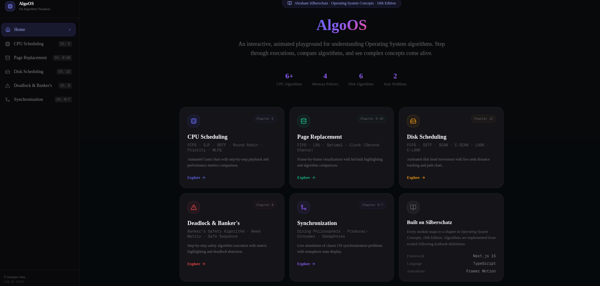

# AlgoOS — OS Algorithm Visualizer

An interactive, animated playground for understanding Operating System algorithms, based on **Abraham Silberschatz — Operating System Concepts, 10th Edition**.

**Live Demo:** https://algo-os-493c.vercel.app/

---

## Modules

| Module | Algorithms | Chapter |
|---|---|---|
| CPU Scheduling | FCFS, SJF, SRTF, Round Robin, Priority, MLFQ | Ch. 5 |
| Page Replacement | FIFO, LRU, Optimal, Clock (Second Chance) | Ch. 9–10 |
| Disk Scheduling | FCFS, SSTF, SCAN, C-SCAN, LOOK, C-LOOK | Ch. 12 |
| Deadlock & Banker's | Banker's Safety Algorithm, Need Matrix, Safe Sequence | Ch. 8 |
| Synchronization | Dining Philosophers, Producer-Consumer, Semaphores | Ch. 6–7 |

## Tech Stack

- **Framework:** Next.js 15 (App Router)
- **Language:** TypeScript
- **Animations:** Framer Motion
- **State:** Zustand
- **Charts:** Recharts
- **Styling:** Tailwind CSS

## Run Locally

```bash
git clone https://github.com/SparksFlash/AlgoOS.git
cd AlgoOS
npm install
npm run dev
```

Open [http://localhost:3000](http://localhost:3000)

---

**Sandipto Saha · CSE-19 · Patuakhali Science and Technology University (PSTU)**  
OS Algorithms Sessional Project

<p align="center">
  
</p>
